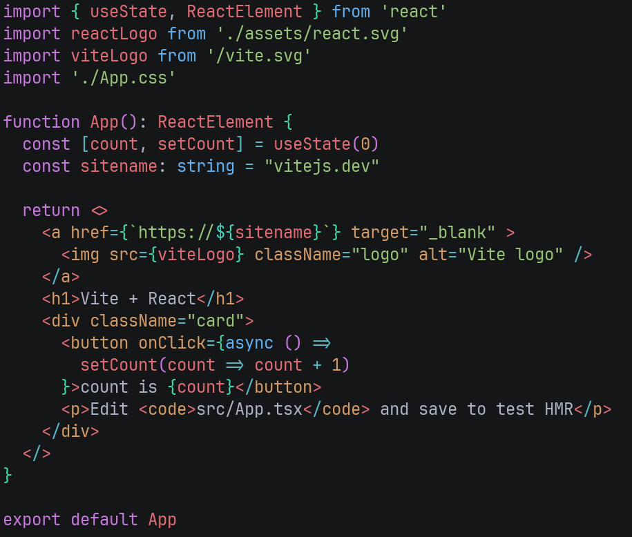

# Lex-highlighter

100% stream-based $\mathcal O(n)$ syntax highlighter for ANSI terminal

> [!WARNING]  
> This is proof-of-concept implementation and WON't be colorful like existing syntax highlighter solutions.

## Stream format

```ebnf
<stream> ::= (<span> <newline>)*
<span> ::= <number> <ws> <number> <ws> <colorprofile>
<number> ::= 0 | [1-9] [0-9]*
<colorprofile> ::= <color> | "!" <color> | <color> <ws> "!" <color> | "!" <color> <ws> <color>
<color> ::= "#" <hex>{6}
<hex> ::= [0-9a-fA-F]
<ws> = (" " | "\t")+
```

1. Negative indexing is not supported.
2. Currently only hex colors are supported.
3. Hex colors should have exactly 6 digits.
4. Use `!`(inverse) to represent background color.
5. You can use foreground and background colors at the same time, but you can't use more than one foreground / background colors.
6. Styles(_italic_, **bold**, etc) are not supported yet.
7. Empty lines are not allowed.

## Example

Proof-of-concept example highlighter using [swc](https://github.com/swc-project/swc).

```sh
$ cargo run --example js-highlighter ./examples/sample.ts | cargo run ./examples/sample.ts
```

## Result


